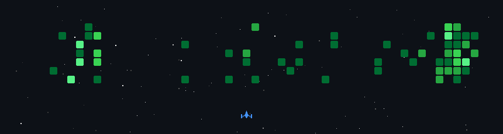

# 
 My GitHub Activity Game

  

I'm a passionate developer interested in GenAI, Machine Learning, Full Stack Development (TypeScript, Node/Express, Python, JavaScript), and Systems Programming.

## 🚀 Projects

- **[Velocis](https://github.com/RJScripts-24/Velocis)**:  
  Embeds an AI senior engineer into your repo – automating reviews, tests, and documentation. A GenAI full-stack system for developer productivity.
- **[NitiNirmaan](https://github.com/NA0XY/NitiNirmaan)**:  
  Modern TypeScript project focused on web app development.
- **[Bangalore Urban Flooding GEE](https://github.com/NA0XY/bangalore-urban-flooding-gee)**:  
  Machine learning workflows for geospatial flood prediction and web visualization.

## 🛠️ Tech Stack

## 📈 GitHub Stats

